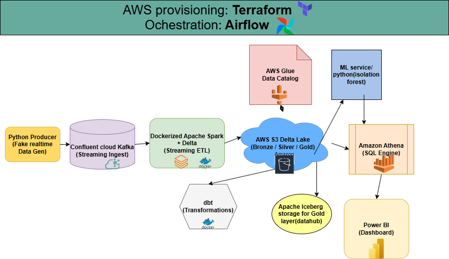
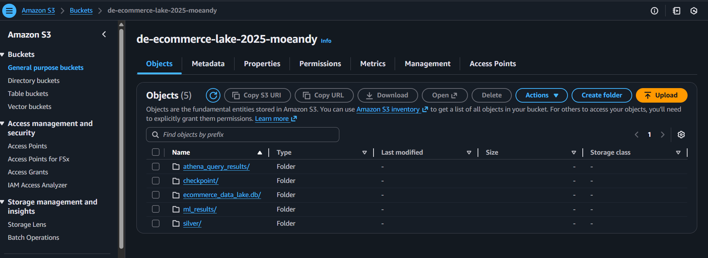

# This project demonstrates a production-grade, fully containerized, scalable, end-to-end real time data engineering project: from streaming ingestion using kafka and spark to iceberg lakehouse using medallion architecture provisioned. through Terraform and Orchestrated using Airflow.

**The Problem:** Processing high-velocity e-commerce event data (purchases) while ensuring data consistency (ACID), schema evolution, and automated fraud detection.

**The Solution:** A decoupled architecture using Kafka for streaming, Spark for processing, and Apache Iceberg for a governed "Gold" Data Hub.

## Architecture Diagram

The entire infrastructure is provisioned via Terraform and orchestrated by Apache Airflow.

## Project Tech Stack

- **Infrastructure:** Terraform (AWS S3, Glue, Athena)

- **Orchestration:** Apache Airflow (DAG management)

- **Ingestion:** Python Producer (Mock Data Generator), Kafka, AWS S3.

- **Processing:** Apache Spark (PySpark), Docker -> Streaming ETL.(Silver layer).

- **Storage:** Multi-tier S3 Data Lake (Bronze/Silver/Gold) powered by Apache Iceberg, and AWS Glue Data Catalog.

- **Governance -Data hub:** AWS Glue Data Catalog: centralized metadata repository, for seamless schema discovery and versioning across Silver and Gold layers.

- **Transformation:** Modular SQL modeling and lineage with dbt (Gold layer).

- **Machine Learning:** Python (Isolation Forest for Anomaly Detection)

 - **Analytics:** Amazon Athena & Power BI

## Medallion Data Hub (Iceberg) Model
Instead of traditional Parquet files, I utilized Apache Iceberg to bring warehouse-like capabilities to the Data Lake.

**Bronze:** Raw Kafka offsets persisted as immutable JSON records.

**Silver:** Spark-cleaned datasets with schema enforcement.

**Gold (The Hub):** Governed Iceberg tables supporting ACID transactions and Schema Evolution, allowing downstream consumers (ML/BI) to query stable, reliable data.

## Data Transformation & Lineage
Dbt was used to manage the Gold layer transformation logic and documentation. This ensures that every column in the Gold Layer is documented and tested for quality.

fct_purchases: The primary fact table, is enriched with metadata and validated through dbt tests (unique, not_null).

Metadata Management: Even when the cluster is offline, the dbt-generated documentation provides 100% visibility into the data lifecycle.

## Pipeline Orchestration
To ensure data integrity and handle dependencies between streaming ingestion and batch transformations, Apache Airflow was used.

Orchestration Logic:

**Dependency Management:** The DAG is configured to trigger the dbt transformation models only after the Spark Streaming job successfully commits its micro-batch checkpoints to S3 and delta to iceberg conversion.

**Failure Handling:** Implemented retry logic to maintain pipeline uptime.

**Atomicity:** By orchestrating the flow, it ensured that the Gold Layer is never updated if the upstream Silver layer processing fails, preventing data corruption in the Lakehouse.

## Business Intelligence & MLOps
The final layer is a Sales Intelligence Dashboard connected via Amazon Athena. This isn't just a report; it's a monitoring tool for data health.

Key Insights & Monitoring:
**Sales Anomaly Detection:** Integration with a Scikit-Learn model to flag suspicious transactions in real-time.

**Ingestion Freshness:** A custom "Gauge" metric (currently showing 71 hrs) to monitor pipeline latency and ensure SLA compliance.

**Product Profitability:** High-granularity scatter plots comparing product performance across business member/non-member segments.

## Engineering Challenges & Key Solutions

1. **Ochestration of event driven systems in Airflow**
Problem: A single late file or process can block the entire graph.

Solution: Adding sensors, waits, and branching logic until the pipeline becomes maintainable.

2. **Debbugging multiple/numerous pipeline errors**
Problem: Encountered numerous errors while running the dags some due to missing dependencies, inconsistent names, wrong file paths, package versions, silent fails, indentations and spaces etc.

Solution: Trouble shooting each error as it occurs and counterchecking code before running.

3. **Cost minimization**
Problem: Trying to incur the least amount of cost while still maintaining efficiency and scalability.

Solution: Using open-source software running locally in containers and cheap AWS  services. Also instituting time constrictions on how long the producer runs to limit amount of data ingested.

## Project Costs
  This is an AWS-Centric zero-cost project that uses open-source software (OSS) running locally (free) and connects directly to AWS's cheapest or Always Free services.

## How to Run
Clone the Repo: git clone ...

Spin up Infrastructure: cd IaC/terraform && terraform apply

Start Services: docker-compose up -d (Kafka, Spark, Airflow)

Run Transformations: dbt run --profiles-dir ./profiles
